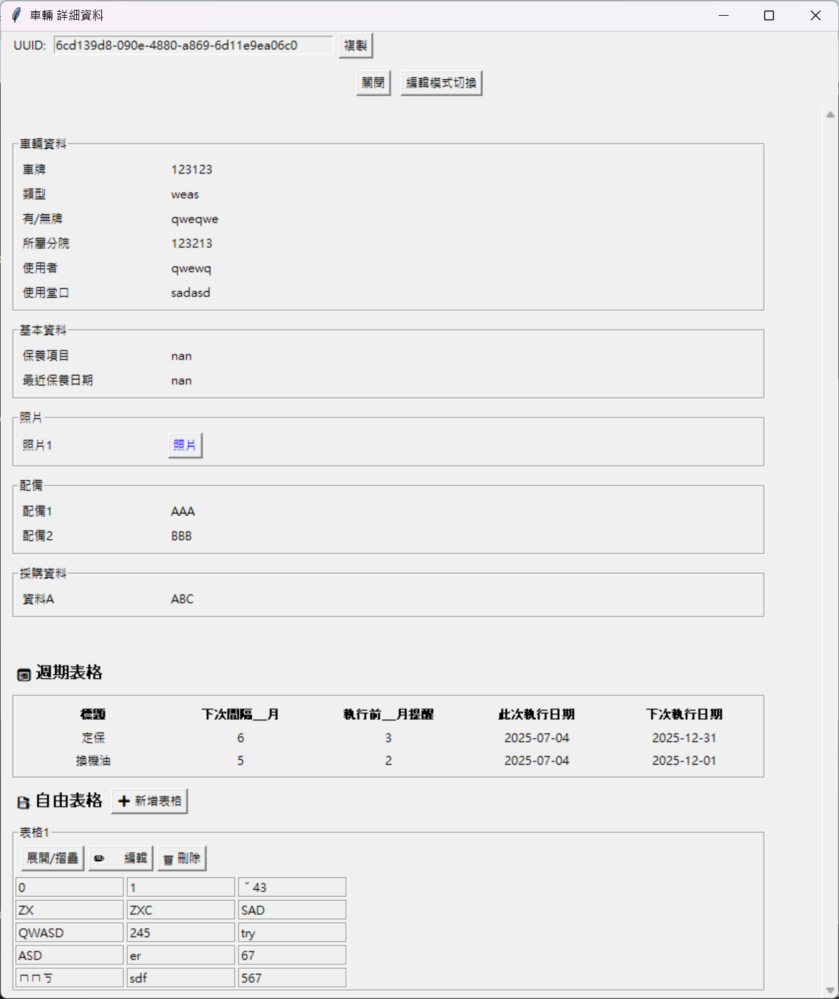

# table_manager
This repository provides a simple tool for managing structured data.  
Its original purpose is to support the following operations for car（車輛）and vendor（廠商）data:  
- Add new entries  
- View and search existing records  
- Edit or update data  
- Delete outdated or incorrect entries  

Although originally designed for this specific use case, the tool is built to be relatively general-purpose,  
and I hope others may find it useful as well.  
The interface and documentation are primarily written in Traditional Chinese(and some hard code) — hope that's not a problem! 
## Installation
```
pip install pandas
pip install openpyxl
```
## Get started
```
python main.py
```
## Usage
Directories should be created as:   
`├─data`   # where Excel files are saved   
`├─links`  # where external copies of the data files are saved, to stabilize against path changes   
`├─period`  # where "period tables" are saved by each data  
`└─tables`  # where tables are saved by *each table*

The detail page should look like the following figure:  
   
   

